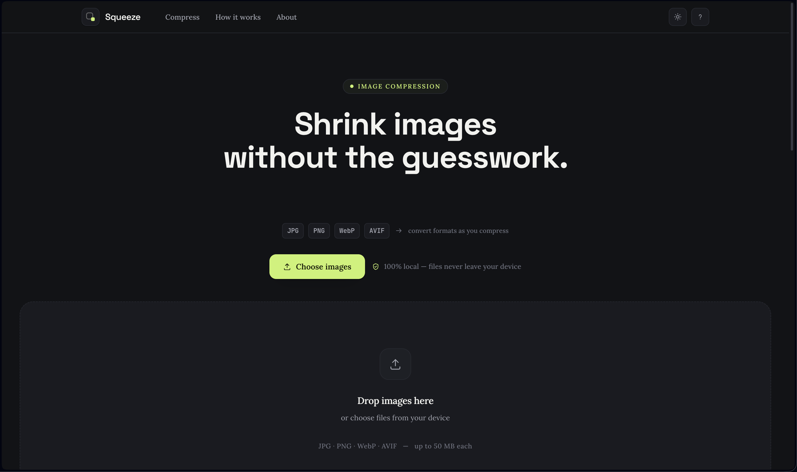
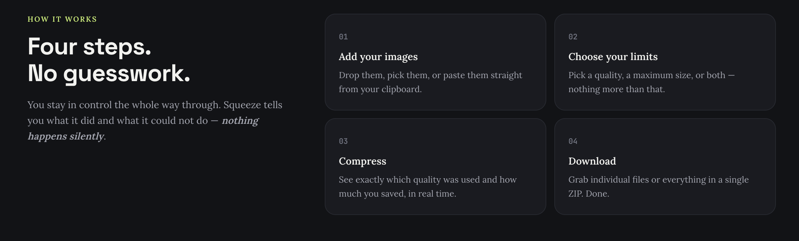
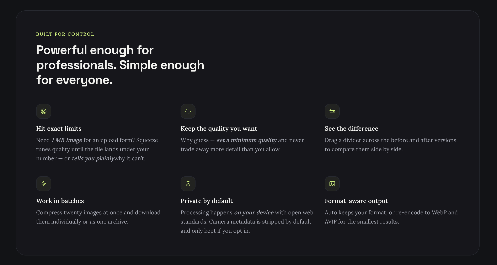
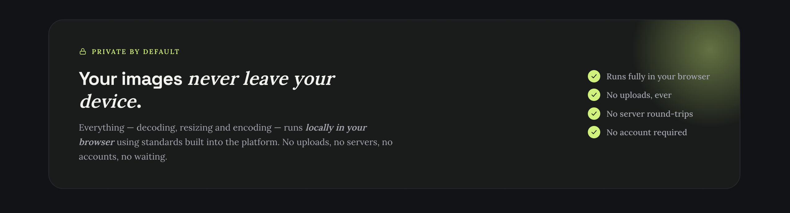
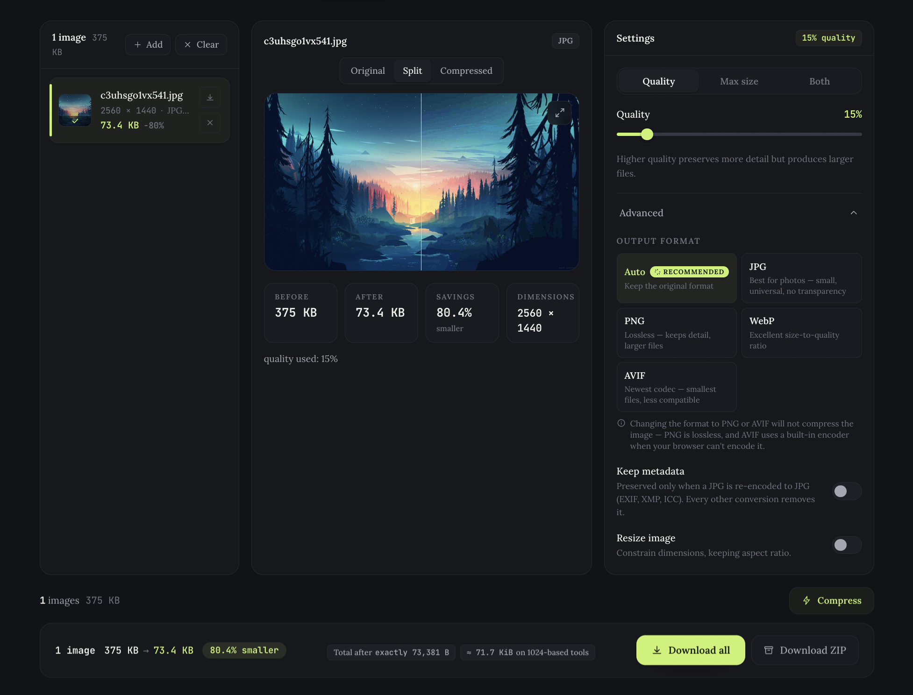

# Squeeze — Image Compressor

> **Shrink images without the guesswork.**

Squeeze is a privacy-first image compressor that gives you precise control over **file size, quality, and output format** — while processing everything directly on your device.

**[Visit Squeeze](https://squeezeit.netlify.app)** · **Source Code — Private**

---

## Preview

Squeeze was built around a simple idea: **image compression shouldn't make you choose between control and simplicity.**

Instead of repeatedly trying different compression tools to meet an upload limit, Squeeze lets you define exactly what you need — whether that's a target file size, a quality setting, or both.

---

## Why Squeeze?

Most image compressors make you choose a quality setting and hope the resulting file is small enough.

Squeeze takes a different approach.

Need an image under **500 KB**? Set the limit.

Want a specific **quality level**? Set it.

Want to control both? You can.

The goal is simple: **give users more control over their own images without adding unnecessary complexity.**

---

## Features

### 🎯 Precise compression controls

Choose how you want to control the result:

* **Quality** — control the compression quality
* **Maximum file size** — target a specific file-size limit
* **Both** — combine quality and size constraints

### 🖼️ Multiple image formats

Work with:

* JPG
* PNG
* WebP
* AVIF

Squeeze can preserve the original format or re-encode images into another supported format.

### 🔍 Before & after comparison

Compare the original and compressed versions with an interactive split-view preview.

See the difference before downloading.

### 📦 Batch processing

Process multiple images together instead of compressing them one at a time.

Download files individually or as a single ZIP archive.

### 🔒 Private by default

Your images **never leave your device**.

Squeeze performs image processing directly in your browser.

* No uploads
* No server round-trips
* No accounts
* No server-side image storage

### 📐 Format-aware output

Keep the original format or choose a different supported output format depending on your needs.

### 📱 Responsive by design

Squeeze is designed to work across desktop, tablet, and mobile screens without sacrificing the core workflow.

### 🌗 Dark & light mode

A complete theme system lets the interface adapt to your preference.

---

## How It Works

### 01 — Add your images

Drop images onto the workspace, select them from your device, or paste them from your clipboard.

### 02 — Choose your limits

Set a quality target, maximum file size, or both.

### 03 — Compress

Squeeze processes the images locally and shows what changed, including file size and savings.

### 04 — Download

Download individual results or everything together as a ZIP archive.

---

## Built for Control

Squeeze is designed around a few principles:

**Exact limits**
When you have a specific upload limit, the compressor should work toward that limit instead of making you guess.

**Quality control**
Compression shouldn't silently sacrifice more detail than necessary.

**Transparent results**
Squeeze shows the original size, resulting size, savings, dimensions, and quality used.

**Batch workflows**
Multiple images should be just as easy to process as one.

**Privacy first**
Images should not need to travel to a server simply to be compressed.

---

## Privacy-First Architecture

Squeeze is intentionally built as a **fully client-side application**.

Image processing happens inside the browser using web platform capabilities and browser-based codecs.

There are:

* No image uploads
* No backend processing
* No server round-trips
* No accounts
* No server-side image storage

Everything stays on the user's device throughout the compression workflow.

---

## Under the Hood

Squeeze is built with modern browser technologies rather than relying on a remote image-processing service.

### Core Stack

* **React** — application architecture and UI
* **JavaScript** — application logic
* **Vite** — development and build tooling
* **Tailwind CSS** — styling and responsive design

### Browser & Processing Technologies

* **Canvas API** — image resizing and processing
* **Web Workers** — background processing without blocking the interface
* **createImageBitmap** — efficient image decoding
* **FileReader / Blob APIs** — local file handling
* **URL.createObjectURL** — local previews
* **@jsquash/avif** — AVIF encoding directly in the browser
* **fflate** — client-side DEFLATE/compression workflows

The architecture keeps the entire image-processing workflow on the user's device.

---

## The Compressor

The main workspace brings the entire workflow together:

* Image queue
* Original / split / compressed preview
* Quality controls
* Maximum file-size controls
* Output format selection
* Metadata controls
* Image resizing
* Compression statistics
* Individual downloads
* ZIP download for batches

The interface is designed to expose useful controls without turning the workflow into a technical configuration panel.

---

## Design

Squeeze follows a **dark-first, monochrome-and-lime visual language** inspired by modern developer tools and utility applications.

### Design Principles

* Near-black charcoal surfaces
* Electric lime used as a functional accent
* Space Grotesk for display typography
* Lora for editorial body text
* JetBrains Mono for technical values and formats
* Subtle borders and layered surfaces
* Glass-like navigation elements
* Film-grain texture
* Spring-based micro-interactions
* Minimal visual decoration

The intention was to create something that feels like a **premium engineering tool** while remaining straightforward enough to use without instructions.

---

## Project Goals

Squeeze was built to explore how much control can be given to users without making a utility tool feel complicated.

The project focuses on:

* Thoughtful UX
* Client-side image processing
* Privacy-first architecture
* Responsive interfaces
* Accessible interactions
* Format-aware image workflows
* Precise compression controls
* Polished micro-interactions

---

## Live Demo

Try Squeeze directly in your browser:

### [squeezeit.netlify.app](https://squeezeit.netlify.app)

No installation or account required.

---

## Built by

**Vatsal Chevli (VatsalDC)**

Designed and developed as a personal project focused on combining **frontend engineering, UX, and privacy-first browser technologies**.

---

  <strong>Squeeze</strong> 
  Shrink images without the guesswork.

